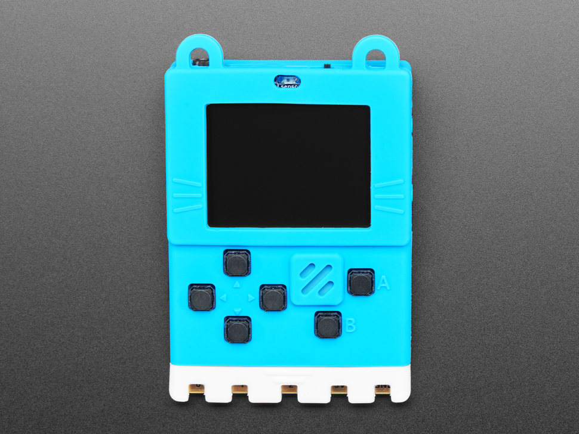
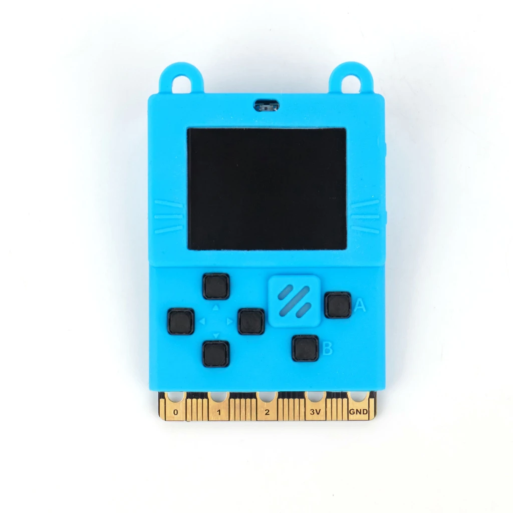
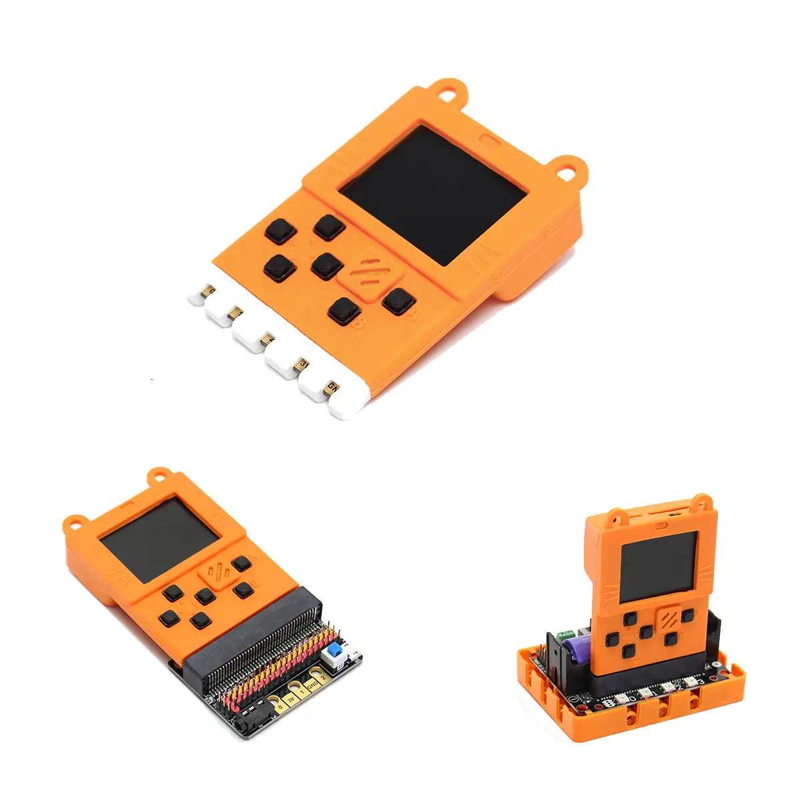
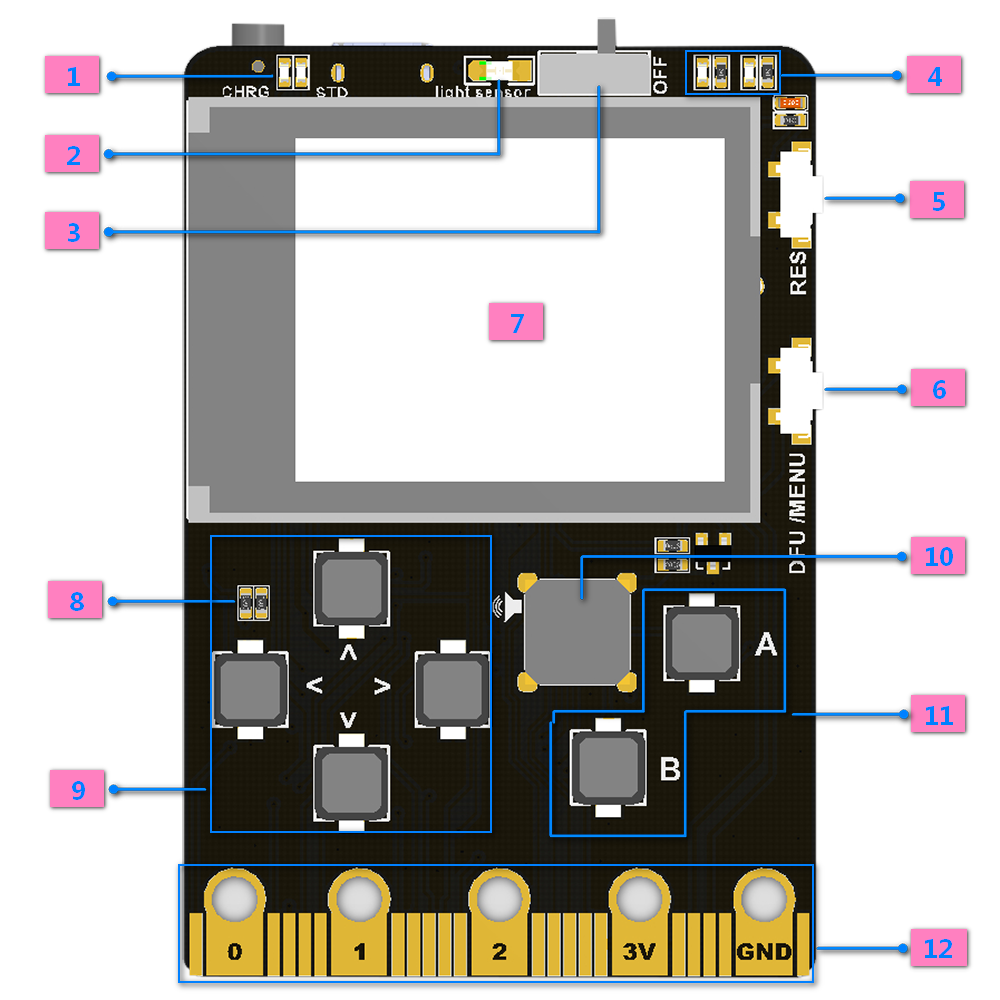
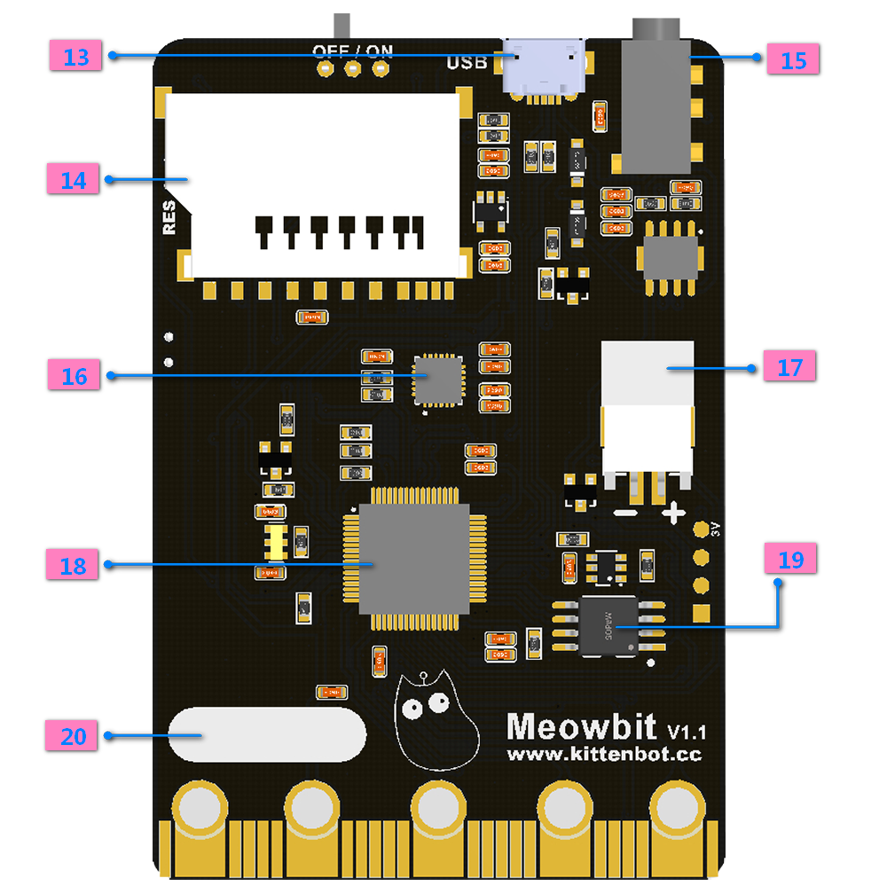
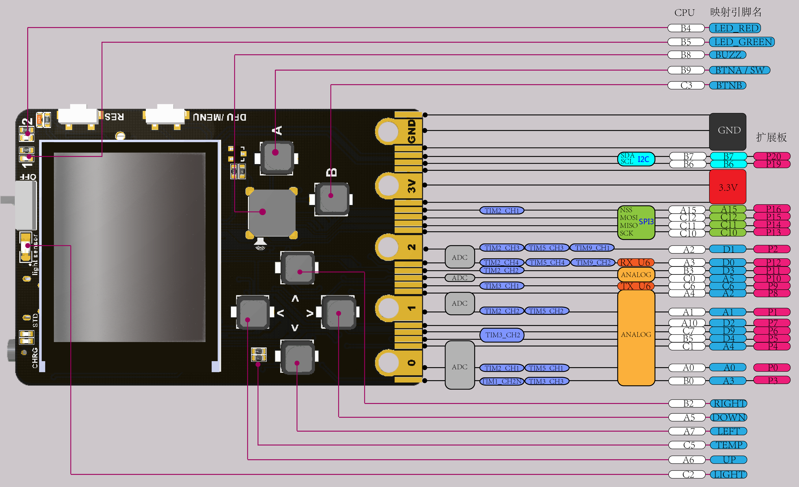

# ConsolaArcade

[Fabricante: kittenbot](https://www.kittenbot.cc/)

[Meowbit consola programable con Arcade/makecode y con micropython](https://www.kittenbot.cc/collections/frontpage/products/meowbit-codable-console-for-microsoft-makecode-arcade)
Compatible a nivel eléctrico con micro:bit (tiene el mismo conector de 40 pines)

Al ser compatible con micro:bit podemos usarla para hacer montajes de robotica

[Enlace de compra](https://m.banggood.com/es/KittenBot-Meowbit-Codable-Console-for-Microsoft-Makecode-Arcade-Game-Programming-Robot-for-Teenagers-p-1526615.html)

## Hardware

[Detalles](https://github.com/KittenBot/meowbit-tutorials-en/blob/master/more/About%20Meowbit%20.md)

* MCU：STM32F401RET6, 32-bit ARM Cortex M4 core
* 2MB SPI flash
* SD card
* 160 x 128 TFT LCD
* Sensors: ligth, temp, MP6050
* 2 x Leds for users
* Buzzer
* 4 x direction buttons + A & B + menu button
* Reset Button
* on/off power
* USB micro
* Operating voltage: 3.3V
* Supply voltage：USB(5V), Lithium battery pack(3.7~4.2V)
* Charging lipo circuit
* Headphone Multiplayer NOT A AUDIO PORT
* Output current: 500mA(max)
* Dimensions: 52x76x12(mm)

1. Charging/work indicator
2. Light sensor
3. Power switch
4. Programmable led x 2
5. Reset
6. DFU mode button(use for toggle firmware or for Bring up the menu in makecode mode)
7. 160 x 128 TFT color screen
8. Temperature sensor
9. Direction button x 4 
10. Buzzer 
11. Button A、B x 2 
12. compatible with microbit’s 40 PINs Goldfinger 
13. USB program download port / charging port 
14. SD card slot(Use for store programs or extend wireless modules) 
15. 3.5mm Jackdac 
16. mp6050 gyroscope 
17. 3.7V lithium battery package interface
18. MCU
19. 2MByte spi-flash (default download unicode character table)
20. Signature area

The internal pinout

## Recursos

[Documentacion](http://meowbit-doc.kittenbot.cn/#/)

[Github de kittenbot](https://github.com/KittenBot)

[Software: Kittenblock & Mu-editor](https://www.kittenbot.cc/pages/software)

[Extensión scratch 3 que incluy firmware y ejemplos de micropython](https://github.com/KittenBot/s3ext-meowbit)

## Makecode

[Documentación](http://meowbit-doc.kittenbot.cn/#/makecode/makecode%E5%BF%AB%E9%80%9F%E5%BC%80%E5%A7%8B)

## Kittenblock

[Documentación](http://meowbit-doc.kittenbot.cn/#/kittenblock/kittenblockQS)

[kittenblock (scratch para kittenblock)](https://www.kittenbot.cc/pages/software)

## Micropython

[Port the Micropython para Meowbit](https://github.com/KittenBot/micropython_meowbit)

[How to use micropython on Meowbit](https://www.oztoylib.com.au/2019/07/13/micropython-on-the-kittenbot-meowbit/)

[Ejemplos](https://github.com/KittenBot/micropython_meowbit/tree/uf2/examples/meowbit)

[mu-editor (solo para windows)](https://www.kittenbot.cc/pages/software)

[Tutorial de micropython (en chino)](http://meowbit-doc.kittenbot.cn/#/micropython/micropython%E5%BF%AB%E9%80%9F%E5%BC%80%E5%A7%8B)

### Ejemplos

[LED](./micropython/led.py)

[pin](./micropython/pin.py)

[Button](./micropython/button.py)

[ADC](./micropython/ADC.py)

[UART](./micropython/UART.ppy)