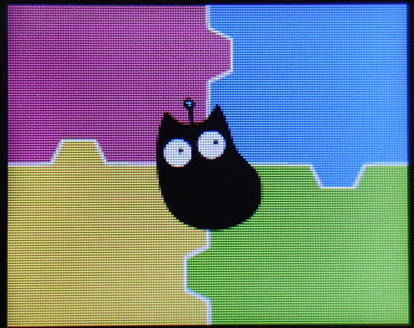
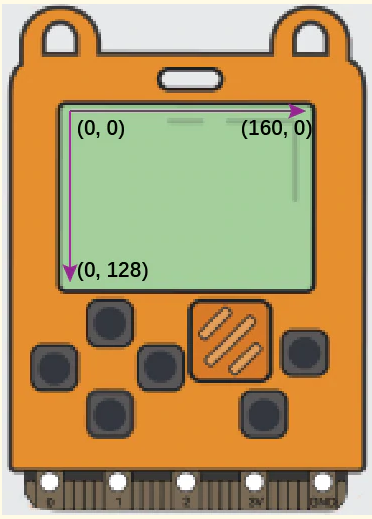

# micropython

Copiamos el firmware de micropython

Conectamos con thonny y vemos el prompt de micropython:

```sh
─────────────────────────────────────────────────────────────────────────────────
MicroPython v1.9.4-1558-g4977005f5-dirty on 2020-08-28; MEOWBIT with STM32F401xE
Type "help()" for more information.
```


Podemos usar módulos _pyb_  y _meowbit_

## led

```python
from pyb import LED
import utime

v = 0.3


led = LED(1)  # available LED（1），LED（2）

print('led on')
led.on()      # switch on the LED
print('led off')
led.off()     # switch off the LED
print('invertir led')
led.toggle()  # invert the LED state
print('fade in')
for i in range(256):
    led.intensity(i)  # value between 0 and 255
    utime.sleep_ms(5)
print('fade out')    
for i in range(255,0,-1):
    led.intensity(i)  # value between 0 and 255
    utime.sleep_ms(5)
print('led off')
led.off()


```

Parece que meowbit ya tiene definidos los componentes: led1, led2 ,...

Al hacer "import meowbit" aparece el logo




```python
import meowbit
import utime

v = 0.1

#  podemos usar meowbit.led1 o led2 que ya vienen definidos

print('led on')
meowbit.led1.on()      # switch on the LED
print('led off')
meowbit.led1.off()     # switch off the LED
print('invertir led')
meowbit.led1.toggle()  # invert the LED state
print('fade in')
for i in range(256):
    meowbit.led1.intensity(i)  # value between 0 and 255
    utime.sleep_ms(5)
print('fade out')    
for i in range(255,0,-1):
    meowbit.led1.intensity(i)  # value between 0 and 255
    utime.sleep_ms(5)
print('led off')
meowbit.led1.off()
```

## Display

Para escribir en pantalla

```python
import meowbit
meowbit.screen.text("hola",10,20) # x=10, y = 20
colorVerde = (168, 233, 74)
fontSize = 1 # tamaño por defecto 8x8
screen.text('Texto en Verde', 0, 20, fontSize, colorVerde )
```

(screen.textCh('texto en chino') para mostrar caracteres chinos)

Si vamos a trabajar mucho podemos desactivar la sincronización con

screen.sync = 0


y tendremos que terminar con screen.refresh()




## Botones

sensor.btnValue(btn) para ver el estado de un botón que puede ser 'a', 'b', 'up', 'down', 'left', 'right' 

Podemos definir funciones que se disparan al cambiar de estado

def fn():
      led1.toggle()
      time.sleep_ms(100) # para evitar rebotes

sensor.btnTrig['a'] = fn
sensor.startSchedule() # No matter how many interrupt threads you have, you only need execute this line once


## referencia

https://www.kittenbot.cc/blogs/learn/meowbit-micropython-programming    